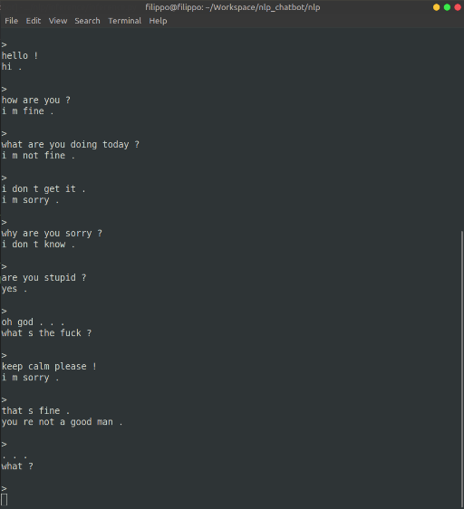

# NLP Chatbot project

Keywords: Python, TensorFlow, Deep Learning, 
Natural Language Processing, Chatbot, Movie Dialogues

## Table of contents

1. [ Installation ](#1-installation)
2. [ Introduction ](#2-introduction)  
    2.1 [ Goal ](#21-goal)  
    2.2 [ Results ](#22-results)  
3. [ Project structure ](#3-project-structure)
4. [ Dataset ](#4-dataset)
5. [ Project usage ](#5-project-usage)  
    5.1 [ Reformat the raw data .txt files ](#51-reformat-the-raw-data-txt-files)  
    5.2 [ Train the NLP Seq2Seq model ](#52-train-the-nlp-seq2seq-model)  
    5.3 [ Visualize predictions with trained model ](#53-visualize-predictions-with-trained-model)  
    5.4 [ Chat with the Chatbot AI ](#54-chat-with-the-chatbot-ai)
6. [ Todo ](#6-todo)
7. [ Resources ](#7-resources)

## 1. Installation

This project was designed for:
* Python 3.6
* TensorFlow 1.12.0

Please install requirements & project:
```
$ cd /path/to/project/
$ git clone https://github.com/filippogiruzzi/nlp_chatbot.git
$ cd nlp_chatbot/
$ pip3 install -r requirements.txt
$ pip3 install -e . --user --upgrade
```

## 2. Introduction

### 2.1 Goal

The purpose of this project is to design and implement 
a realistic Chatbot based on Natural Language Processing (NLP).

### 2.2 Results



## 3. Project structure

The project `nlp_chatbot/` has the following structure:
* `nlp/data_processing/`: data processing, recording & visualization
* `nlp/training/`: data input pipeline, model 
& training / evaluation / prediction operations
* `nlp/inference/`: exporting trained model & inference

## 4. Dataset

Please download the [ Cornell Movie-Dialogs Corpus dataset ](https://www.cs.cornell.edu/~cristian/Cornell_Movie-Dialogs_Corpus.html), 
and extract all files to `/path/to/cornell_movie_data/`. The challenge description can be found on 
[ Kaggle ](https://www.kaggle.com/rajathmc/cornell-moviedialog-corpus).

The dataset consists of 220 579 conversational exchanges between 10 292 pairs of movie characters and 
involves 9 035 characters from 617 movies, and is thus well suited for realistic chatbot applications.

## 5. Project usage

```
$ cd /path/to/project/nlp_chatbot/nlp/
```

### 5.1 Reformat the raw data .txt files

```
$ python3 data_processing/data_formatter.py --data-dir /path/to/cornell_movie_data/
```

### 5.2 Train the NLP Seq2Seq model

```
$ python3 training/train.py --data-dir /path/to/cornell_movie_data/
```

### 5.3 Visualize predictions with trained model

```
$ python3 training/train.py --data-dir /path/to/cornell_movie_data/tfrecords/
                            --mode predict
                            --model-dir /path/to/trained/model/dir/
                            --ckpt /path/to/trained/model/dir/
```

### 5.4 Chat with the Chatbot AI

```
$ python3 inference/export_model.py --model-dir /path/to/trained/model/dir/
                                    --ckpt /path/to/trained/model/dir/
$ python3 inference/inference.py --data_dir /path/to/cornell_movie_data/
                                 --exported_model /path/to/exported/model/
```

The trained model will be recorded in `/path/to/cornell_movie_data/tfrecords/models/seq2seq/`. 
The exported model will be recorded inside this directory.

## 6. Todo

* [x] Full training on Colab
* [ ] Add Google Colab demo
* [x] Add attention
* [x] Debug training accuracy
* [ ] Add evaluation accuracy
* [x] Inference model & script
* [x] Chatbot interface
* [ ] Clean OOP inference
* [ ] Add architecture on ReadMe
* [ ] Add Beam search decoding & random sampling decoding
* [ ] Add Softmax temperature
* [ ] Add complex models
* [ ] Add & compare with statistical baseline
* [ ] Add perplexity
* [ ] Visualize attention
* [ ] Add char level model
* [ ] Add BPE (Byte Pair Encoding)
* [ ] Train on maximizing MMI (Maximum Mutual Information)

## 7. Resources

This project was widely inspired by:
* _Pytorch chatbot tutorial_, [ Pytorch website ](https://pytorch.org/tutorials/beginner/chatbot_tutorial.html)
* _Pytorch NLP tutorial_, [ Pytorch website ](https://pytorch.org/tutorials/intermediate/seq2seq_translation_tutorial.html)
* _TensorFlow NLP tutorial_, [ TensorFlow website ](https://www.tensorflow.org/tutorials/text/text_generation)
* _Keras NLP tutorial_, [ TDS ](https://towardsdatascience.com/how-to-implement-seq2seq-lstm-model-in-keras-shortcutnlp-6f355f3e5639)
* _Kaggle challenge_, [ Kaggle ](https://www.kaggle.com/rajathmc/cornell-moviedialog-corpus)
* _Sequence to Sequence Learning with Neural Networks_, 
I. Sutskever, O. Vinyals, Q. V. Le, 2014, 
[ Arxiv ](https://arxiv.org/abs/1409.3215)
* _A Neural Conversational Model_, 
O. Vinyals, Q. Le, 2015, 
[ Arxiv ](https://arxiv.org/abs/1506.05869)
* _Learning Phrase Representations using RNN Encoder-Decoder for Statistical Machine Translation_, 
K. Cho, B. van Merrienboer, C. Gulcehre, D. Bahdanau, F. Bougares, H. Schwenk, Y. Bengio, 2014, 
[ Arxiv ](https://arxiv.org/abs/1406.1078)
* _Effective Approaches to Attention-based Neural Machine Translation_, 
M-T. Luong, H. Pham, C. D. Manning, 2015, 
[ Arxiv ](https://arxiv.org/abs/1508.04025)
* _Neural Machine Translation by Jointly Learning to Align and Translate_, 
D. Bahdanau, K. Cho, Y. Bengio, 2014, 
[ Arxiv ](https://arxiv.org/abs/1409.0473)
